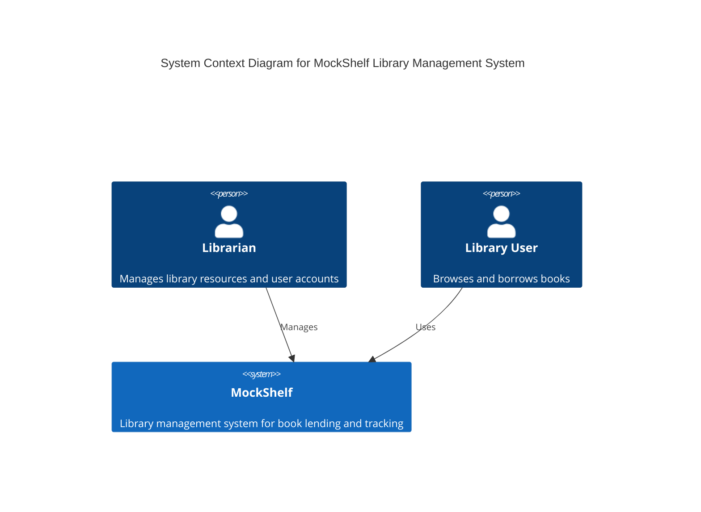
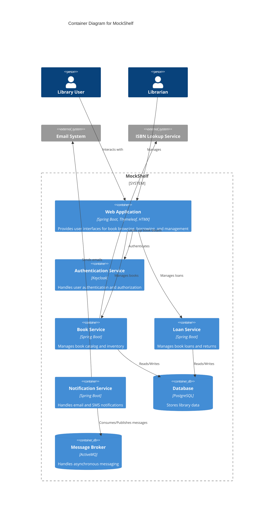
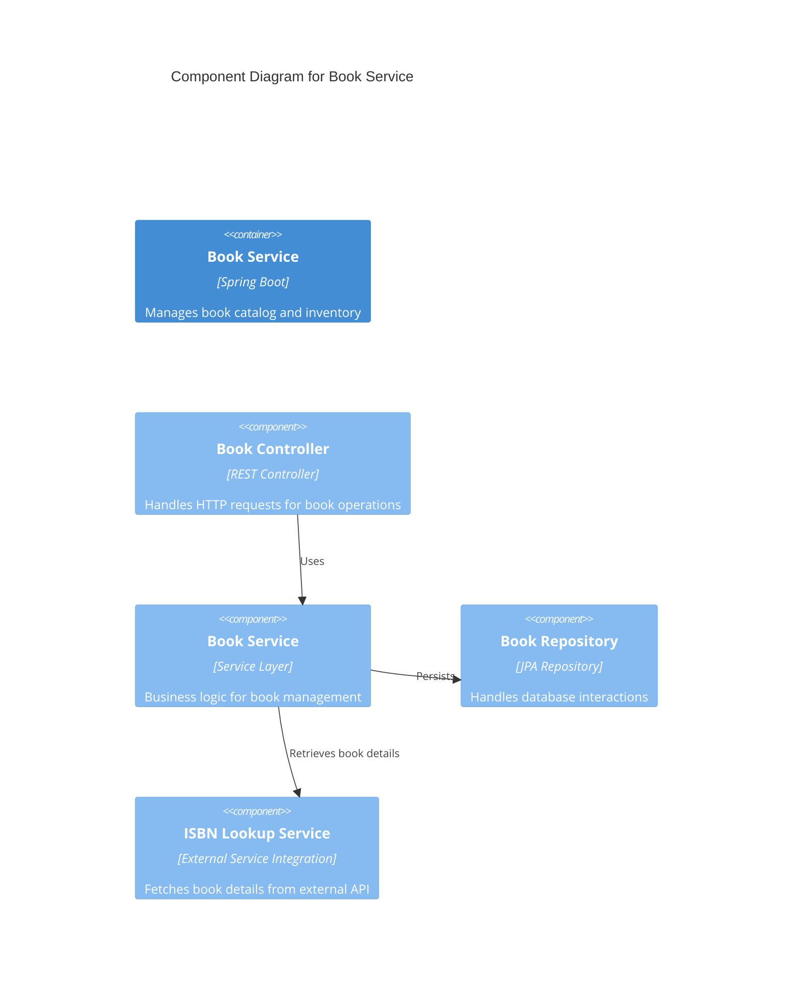

# Mock Shelf

- [ ] Docker Compose: Local Mailing, Mocked Remotes

## Setup

```shell
pre-commit install
```

## MockShelf Architecture Documentation

## Overview

MockShelf is a comprehensive library management system designed for testing and development purposes. It demonstrates modern Spring Boot application architecture with a focus on testing techniques and microservice principles.

## System Context



## Container Diagram



## Component Diagram for Book Service



## Architecture Characteristics

### Key Architecture Drivers
- Testability
- Modularity
- Security
- Performance

### Technology Stack
- **Backend**: Spring Boot 3.4.3
- **Authentication**: Keycloak
- **Database**: PostgreSQL
- **ORM**: Spring Data JPA
- **Messaging**: ActiveMQ
- **Frontend**: Thymeleaf, HTMX, Alpine.js
- **Testing**: JUnit 5, Testcontainers

### Architectural Patterns
- Microservices-like architecture
- Repository pattern
- Event-driven notifications
- Resource server authentication

## Deployment

### Docker Composition
MockShelf uses Docker Compose for local development, spinning up:
- Application container
- PostgreSQL database
- Keycloak authentication
- ActiveMQ message broker
- MailDev for email testing
- WireMock for external service mocking

## Testing Strategy

### Testing Pyramid
- Unit Tests: Extensive coverage of service and repository layers
- Integration Tests: Using Testcontainers for realistic environment
- Web Tests: HTMX and Thymeleaf rendering checks
- End-to-End Tests: Simulated user journeys

### Key Testing Technologies
- JUnit 5
- Testcontainers
- Selenium
- Mockito
- Spring Boot Test

## Security Considerations
- OAuth 2.0 Resource Server
- Role-based access control
- JWT token authentication
- CSRF protection
- HTTPS enforcement

## Monitoring and Observability
- Spring Boot Actuator
- JobRunr for background job tracking
- Logging with SLF4J
- Potential integration with Prometheus/Grafana

## Future Improvements
- Microservices decomposition
- Enhanced caching strategies
- More granular authorization
- Enhanced monitoring
