# Mock Shelf

- [ ] Docker Compose: Local Mailing, Mocked Remotes

## Setup

```shell
pre-commit install
```

## Keycloak

Export realm:

```
```

## MockShelf Architecture Documentation

## Overview

MockShelf is a comprehensive library management system designed for testing and development purposes. It demonstrates modern Spring Boot application architecture with a focus on testing techniques and microservice principles.

## System Context


## Container Diagram


## Component Diagram for Book Service


## Architecture Characteristics

### Key Architecture Drivers
- Testability
- Modularity
- Security
- Performance

### Technology Stack
- **Backend**: Spring Boot 3.4.3
- **Authentication**: Keycloak
- **Database**: PostgreSQL
- **ORM**: Spring Data JPA
- **Messaging**: ActiveMQ
- **Frontend**: Thymeleaf, HTMX, Alpine.js
- **Testing**: JUnit 5, Testcontainers

### Architectural Patterns
- Microservices-like architecture
- Repository pattern
- Event-driven notifications
- Resource server authentication

## Deployment

### Docker Composition
MockShelf uses Docker Compose for local development, spinning up:
- Application container
- PostgreSQL database
- Keycloak authentication
- ActiveMQ message broker
- MailDev for email testing
- WireMock for external service mocking

## Testing Strategy

### Testing Pyramid
- Unit Tests: Extensive coverage of service and repository layers
- Integration Tests: Using Testcontainers for realistic environment
- Web Tests: HTMX and Thymeleaf rendering checks
- End-to-End Tests: Simulated user journeys

### Key Testing Technologies
- JUnit 5
- Testcontainers
- Selenium
- Mockito
- Spring Boot Test

## Security Considerations
- OAuth 2.0 Resource Server
- Role-based access control
- JWT token authentication
- CSRF protection
- HTTPS enforcement

## Monitoring and Observability
- Spring Boot Actuator
- JobRunr for background job tracking
- Logging with SLF4J
- Potential integration with Prometheus/Grafana

## Future Improvements
- Microservices decomposition
- Enhanced caching strategies
- More granular authorization
- Enhanced monitoring

# MockShelf Infrastructure Architecture

## External Infrastructure Components

```mermaid
graph TD
    subgraph "External Services & Infrastructure"
        KC[" 🔐 Keycloak\nAuthentication & Authorization"]
        PG[" 🐘 PostgreSQL\nPersistent Data Storage"]
        AMQ[" 📬 ActiveMQ\nMessage Queuing"]
        MD[" 📧 MailDev\nEmail Testing"]
        WM[" 🌐 WireMock\nExternal API Simulation"]
        JR[" 🏃 JobRunr\nBackground Job Processing"]
        ISBN[" 📖 Open Library API\nISBN Book Lookup"]
    end

    subgraph "MockShelf Application"
        APP[" 🚀 Spring Boot App\nCore Application Logic"]
    end

    subgraph "Development & CI/CD"
        GH[" 🐙 GitHub\nSource Control"]
        DC[" 🐳 Docker Compose\nLocal Environment"]
        PC[" 🧪 Pre-commit\nCode Quality Checks"]
        MVN[" 🌟 Maven\nDependency Management"]
    end

    subgraph "Monitoring & Observability"
        ACT[" 🔍 Spring Actuator\nSystem Monitoring"]
        LOG[" 📊 SLF4J Logging\nApplication Logs"]
    end

    APP <-->|Authentication| KC
    APP <-->|Persistent Storage| PG
    APP <-->|Messaging| AMQ
    APP <-->|Job Processing| JR
    APP <-->|Book Lookup| ISBN

    DC <-->|Manages| KC
    DC <-->|Manages| PG
    DC <-->|Manages| AMQ
    DC <-->|Manages| MD
    DC <-->|Manages| WM

    GH <-->|CI/CD| APP
    MVN <-->|Dependency Management| APP

    APP <-->|Monitoring| ACT
    APP <-->|Logging| LOG
```



## Infrastructure Components Detailed Description

### Authentication & Authorization
- **Keycloak** 🔐
  - Open-source identity and access management
  - Provides OAuth 2.0 and OpenID Connect
  - Handles user authentication, authorization, and user management

### Data Storage
- **PostgreSQL** 🐘
  - Robust, open-source relational database
  - Stores books, loans, users, and other library-related data
  - Supports complex queries and transactions

### Messaging & Queuing
- **ActiveMQ** 📬
  - Message broker for asynchronous communication
  - Enables event-driven notifications
  - Supports complex messaging patterns

### Email & Testing
- **MailDev** 📧
  - SMTP testing server
  - Captures and displays outgoing emails
  - Helps in development and testing email functionality

### API Mocking
- **WireMock** 🌐
  - Lightweight API mocking tool
  - Simulates external service responses
  - Enables predictable testing of external integrations

### Background Processing
- **JobRunr** 🏃
  - Distributed background job processing
  - Manages and monitors long-running tasks
  - Provides job scheduling and retry mechanisms

### Book Lookup
- **Open Library API** 📖
  - Free, open-source book information API
  - Provides book details based on ISBN
  - Enriches book catalog with external metadata

### Development & CI/CD
- **GitHub** 🐙
  - Source code management
  - Workflow automation
  - Continuous integration

- **Docker Compose** 🐳
  - Local environment orchestration
  - Simplifies service dependencies
  - Ensures consistent development setup

- **Pre-commit** 🧪
  - Code quality checks
  - Enforces coding standards
  - Runs linters and formatters before commits

- **Maven** 🌟
  - Dependency management
  - Build automation
  - Project structure and plugin management

### Monitoring & Observability
- **Spring Actuator** 🔍
  - Provides production-ready features
  - Health checks and metrics
  - Exposes operational information

- **SLF4J Logging** 📊
  - Standardized logging facade
  - Configurable log levels
  - Supports multiple logging implementations

## Design Principles

1. **Modularity**: Each component has a clear, focused responsibility
2. **Testability**: Easy to mock and test individual components
3. **Scalability**: Loosely coupled services
4. **Developer Experience**: Tools that enhance productivity

## Deployment Considerations

- Local development with Docker Compose
- Potential Kubernetes deployment for scaling
- Stateless design for horizontal scaling
- Centralized configuration management
